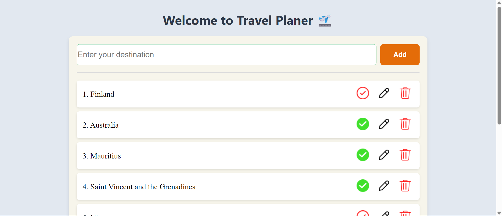

---

## 🛫 Travel Planner

A simple and beginner-friendly web app to manage your travel destinations. Add, edit, mark as visited, or delete places you'd love to explore — all powered by [MockAPI](https://mockapi.io).

---

### ✨ Features

- ✅ Add new destinations to your travel list  
- ✏️ Edit existing destinations  
- ✅ Mark destinations as visited/unvisited  
- 🗑️ Delete destinations with confirmation  
- 🔄 Real-time updates using MockAPI  
- 📱 Responsive and clean UI

---

### 🧰 Tech Stack

| Technology | Purpose |
|------------|---------|
| HTML, CSS  | UI structure and styling |
| JavaScript | App logic and interactivity |
| MockAPI    | Backend simulation for CRUD operations |

---

### 🚀 Getting Started

#### 1. Clone the repository

```bash
git clone https://github.com/your-username/travel-planner.git
cd travel-planner
```

#### 2. Open `index.html` in your browser

No build tools required — it's a pure frontend project!

---

### 🛠️ API Configuration

This app uses [MockAPI](https://mockapi.io) for backend simulation. The default endpoint is:

```js
const API_URL = 'https://6912d01d52a60f10c822d657.mockapi.io/api/v1/destinations';
```

You can replace it with your own MockAPI project URL if needed.

---

### 📸 Screenshots

> 

---

### 🙌 Author

**MD. Sabbir Hossain** — University student passionate about programming, and building real-world projects.

---

### 📄 License

This project is open-source and free to use under the [MIT License](https://opensource.org/licenses/MIT).

---

